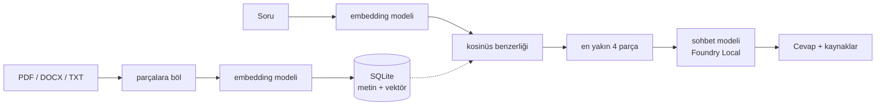

# 📚 TOK Çalışma Asistanı — Foundry Local ile Yerel RAG

Kendi belgelerine soru sorabildiğin, **tamamen kendi bilgisayarında çalışan** bir
soru-cevap asistanı. İnternet bağlantısı gerekmez, bulut hesabı gerekmez, hiçbir
belge cihazdan dışarı çıkmaz.

Microsoft Foundry Local ile cihaz üzerinde çalışan dil modeli + RAG
(Retrieval-Augmented Generation) kalıbı üzerine kurulu.

**▶️ Demo videosu (2 dk):** `<DRIVE_LINKINI_BURAYA_YAPIŞTIR>`

> **Ekran görüntüsü eklemek için:** uygulamayı çalıştır, bir soru sor, Kaynaklar
> kutusunu aç ve `Cmd+Shift+4` ile pencereyi yakala. Görüntüyü
> `docs/screenshot.png` olarak kaydet, sonra bu satırın altına şunu ekle:
> ``

📓 **[IB Notebook](docs/ib-notebook.md)** — Extended Essay, Internal Assessment
ve TOK için ayrı bir linkli kaynak listesi (resmi ibo.org sayfaları +
saygın üçüncü parti rehberler, işaretli).

---

## Ne işe yarıyor?

IB TOK sergisi hazırlarken beş ayrı PDF arasında ileri geri gidip "kaç nesne
isteniyordu", "yorum kaç kelime", "rubric'te en üst seviye ne diyor" diye
aramak yerine, doğrudan soruyorsun:

> **Soru:** Sergi yorumu en fazla kaç kelime olabilir?
>
> **Cevap:** Sergi yorumu en fazla 950 kelime olabilir. [TOK Subject Guide 2020, s.45]

Cevabın altında **hangi belgeden, hangi sayfadan** geldiği yazıyor — ve o
parçanın metnini açıp kendin de görebiliyorsun. Belgelerde olmayan bir şey
sorduğunda ise *"Bu belgelerde bulamadım"* diyor. Bunu iddia olarak bırakmadık,
[`eval.py`](eval.py) ile ölçtük: sonuçlar [`eval_results.md`](eval_results.md)
içinde.

Bu asistan TOK belgeleriyle kuruldu ama **her belge koleksiyonuyla çalışır** —
ders notların, yarışma şartnameleri, kullanım kılavuzları, ne istersen.

---

## RAG nedir? (sıfırdan, sade anlatım)

Bir dil modeline senin PDF'lerinden soru soramazsın; onların varlığından bile
haberi yoktur. RAG bu problemi üç adımda çözer:

### 1. Retrieve — Bul

Belgeler küçük parçalara bölünür (bu projede ~900 karakter). Her parça bir
**embedding modeli** ile sayı dizisine — yani bir **vektöre** — çevrilir.

Bu vektörlerin sihri şu: *anlamca benzer metinler, uzayda birbirine yakın
vektörlere dönüşür.* Kelimeler farklı olsa bile. Hatta **dil farklı olsa bile** —
bu projede kullanılan model çok dilli olduğu için "üç nesne" ile "three objects"
birbirine yakın çıkıyor. Ölçtük: aynı anlamın Türkçe–İngilizce benzerliği
**0.72**, alakasız bir cümleyle benzerlik **0.17**.

Sen soru sorduğunda soru da vektöre çevrilir ve **hangi parçanın vektörü soruya
en yakın** ona bakılır.

> **Bu projede yapılan iki ek iyileştirme** — ikisi de ölçüm sonucu eklendi:
>
> **1. Hibrit arama.** Sadece vektör araması sayıları bulanıklaştırıyor.
> "Yorum kaç kelime olabilir?" diye sorduğunda konu olarak yakın ama içinde
> "950" geçmeyen paragraflar öne çıkıyordu. Bu yüzden vektör skoruna bir de
> **kelime eşleşmesi** skoru ekledik (IDF ağırlıklı — nadir kelimeler daha
> değerli). Nihai skor: `0.7 × vektör + 0.3 × kelime`. Vektör anlamı yakalıyor,
> kelime eşleşmesi tam sayıları ve özel terimleri kaçırmıyor.
>
> **2. Sorgu çevirisi.** Belgeler İngilizce, sorular Türkçe. Ölçtüğümüzde
> Türkçe soruların İngilizce belgelerle benzerliği hep 0.35–0.55 bandında
> sıkışıyordu — yani cevabı içeren parça ile alakasız parça neredeyse aynı
> skoru alıyordu. Çözüm: arama yapmadan önce soruyu kısa bir İngilizce arama
> sorgusuna çeviriyoruz (yerel modelle, yarım saniye), sonra hem orijinal hem
> çeviriyle arıyoruz. `config.TRANSLATE_QUERY` ile kapatılabilir.

Yakınlığı nasıl ölçüyoruz? **Kosinüs benzerliği** ile:

```
benzerlik(a, b) = (a · b) / (|a| × |b|)
```

Bu, iki vektör arasındaki açının kosinüsü — yani derste gördüğün vektör
konusunun ta kendisi. 1'e yakınsa aynı yöne bakıyorlar (aynı şeyden
bahsediyorlar), 0'a yakınsa alakasızlar. **Uzunluk değil yön** önemli: uzun bir
paragrafla kısa bir cümle aynı konudaysa yine yüksek skor alır.

> **Küçük bir optimizasyon:** tüm vektörleri önceden birim uzunluğa normalize
> ettiğimiz için formülün paydası 1 oluyor ve arama tek bir matris çarpımına
> iniyor (`matris @ soru_vektörü`). 279 parça milisaniyelerde taranıyor,
> her parça için ayrı döngü kurmaya gerek kalmıyor.

### 2. Augment — Bağlama ekle

Bulunan en yakın 4 parça, modele gönderilen mesajın içine bağlam olarak
yerleştirilir. Modele açıkça şu söylenir: *"Sadece bu metinlere bakarak cevapla.
Burada yoksa bilmediğini söyle."*

### 3. Generate — Üret

Model cevabı yazar. Cevap eğitim verisinden değil, **senin belgelerinden** gelir.

### Neden fine-tuning değil?

Modele yeni bilgi öğretmenin diğer yolu onu **eğitmek** (fine-tuning). Ama:

| | RAG | Fine-tuning |
|---|---|---|
| Süre | Dakikalar | Saatler–günler |
| Donanım | Normal laptop | Güçlü GPU |
| Bilgi güncelleme | Dosyayı değiştir, yeniden indeksle | Baştan eğit |
| Kaynak gösterme | Var | Yok |
| Uydurma riski | Düşük (metin önünde) | Yüksek |

Bu projede **hiçbir model eğitilmiyor.** Hazır modeller indiriliyor, belgeler
bir kez vektörleştiriliyor ve sonuç SQLite'a yazılıyor. İkinci çalıştırmadan
itibaren açılış anında.

---

## Mimari



Ayrıntılı diyagram ve tasarım gerekçeleri: [docs/architecture.md](docs/architecture.md)

| Dosya | Ne yapar |
|---|---|
| [`config.py`](config.py) | Tüm ayarlar tek yerde — model, parça boyutu, kaç kaynak |
| [`src/loaders.py`](src/loaders.py) | PDF/DOCX/TXT → sayfa numaralı metin |
| [`src/chunker.py`](src/chunker.py) | Metni örtüşmeli parçalara böler |
| [`src/store.py`](src/store.py) | SQLite şeması, vektörleri BLOB olarak saklar |
| [`src/backends.py`](src/backends.py) | Foundry Local (ana) / Ollama (yedek) motorları |
| [`src/rag.py`](src/rag.py) | Arama + bağlam kurma + akışlı cevap |
| [`ingest.py`](ingest.py) | Belgeleri indeksler |
| [`app.py`](app.py) | Streamlit arayüzü |
| [`eval.py`](eval.py) | Doğruluk ve "uydurma" testleri |

---

## Kurulum

### Gereksinimler

- **macOS (Apple Silicon)**, Windows veya Linux
- En az **8 GB RAM** (16 GB rahat eder)
- **Python 3.11, 3.12 veya 3.13**
  ⚠️ Python 3.10 ve öncesi ile **3.14** çalışmaz — Foundry Local SDK bu
  sürümleri desteklemiyor. macOS'ta sistem Python'ı genelde 3.9'dur, o yüzden:

  ```bash
  brew install python@3.12
  ```

- Modeller için ~5 GB boş disk

### Tek komutla kurulum

```bash
bash setup.sh
```

Bu script uygun Python sürümünü bulur, `.venv` sanal ortamını oluşturur ve tüm
paketleri kurar.

<details>
<summary>Elle kurmak istersen</summary>

```bash
/opt/homebrew/opt/python@3.12/bin/python3.12 -m venv .venv
./.venv/bin/pip install -r requirements.txt
```
</details>

### Belgelerini ekle

Kendi PDF / DOCX / TXT / MD dosyalarını `data/documents/` klasörüne at.

Boş bırakırsan proje otomatik olarak `data/sample_documents/` içindeki örnek
korpusu kullanır — yani depoyu klonlayan biri hiçbir dosya eklemeden de
projeyi çalıştırabilir.

### İndeksle

```bash
./.venv/bin/python ingest.py
```

İlk çalıştırmada modeller indirilir (birkaç dakika). Sonraki çalıştırmalarda
sadece **değişen** dosyalar işlenir — saniyeler sürer.

### Çalıştır

```bash
./.venv/bin/streamlit run app.py
```

Tarayıcıda açılır. İstersen Wi-Fi'ı kapat, çalışmaya devam eder.

---

## Testler

Bir chatbot'un "iyi görünmesi" ile "doğru olması" farklı şeylerdir. `eval.py`
iki tür soru sorar:

1. **Cevaplanabilir** — cevabı belgelerde var, asistan doğru kaynağı getirmeli.
2. **Cevaplanamaz** — cevabı belgelerde **yok**, asistan "bulamadım" demeli.

İkincisi daha önemli. Örneğin *"Ay'a ilk kim ayak bastı?"* sorusunun cevabını
model aslında biliyor — ama belgelerde olmadığı için söylememesi gerekiyor.
Bilmediğini uyduran bir asistan, hiç cevap vermeyenden daha tehlikelidir.

```bash
./.venv/bin/python eval.py
```

Sonuçlar [`eval_results.md`](eval_results.md) dosyasına yazılır — her sorunun
cevabı, getirilen kaynaklar, benzerlik skorları ve süresiyle birlikte.

**Son ölçüm** (`qwen2.5-7b`, 9 belge / 279 parça, MacBook Air M2):

| | |
|---|---|
| Geçen test | **9 / 12** |
| Ortalama cevap süresi | 16.6 sn |
| Cevaplanabilir sorularda | 7/9 doğru |
| Cevaplanamaz sorularda | 2/3 doğru şekilde reddetti |

**Testin kendisi de bir ders oldu.** İlk çalıştırmada üç test kaldı ve
"model uydurdu" diye raporladı. Cevaplara baktığımızda model aslında doğru
davranmıştı — sadece *"Bu belgelerde bulamadım"* yerine *"Bağlamda bulamadım"*
demişti. Yani test, modelin doğruluğunu değil kelime tercihini ölçüyordu.
Reddetme tespiti kalıp listesine çevrildi ([`eval.py`](eval.py) içindeki
`REFUSAL_PATTERNS`). Otomatik değerlendirmenin en sinsi hatası bu: ölçtüğünü
sandığın şeyi ölçmüyor olabilirsin.

---

## Model seçimi — neden bu model?

Katalogdaki 46 modelden dördünü aynı bağlam ve aynı soruyla karşılaştırdık
(MacBook Air M2, 16 GB RAM):

| Model | Boyut | İlk token | Cevap süresi | Türkçe kalitesi |
|---|---|---|---|---|
| `qwen2.5-1.5b` | 1.5B | 0.5 sn | ~1 sn | ❌ Cevap bağlamda olduğu halde "bulamadım" dedi; serbest üretimde anlamsız cümleler kurdu |
| `qwen3.5-4b` | 4B | 1.7 sn | **129 sn** | ❌ "Düşünen" model — cevaptan önce 6462 karakterlik iç monolog üretti |
| `phi-4-mini` | 3.8B | 1.2 sn | ~9 sn | ❌ Türkçede kelime tekrarına giriyor ("hangisinin hangisinin…") **ve bu makinede kararsız** — aşağıya bak |
| **`qwen2.5-7b`** | 7B | 2.8 sn | ~17 sn | ✅ **Varsayılan.** 12 testin tamamını sorunsuz tamamladı, Türkçesi en temizi |

**phi-4-mini neden elendi?** Hızlı olduğu için ilk tercihimizdi, ama iki ayrı
denemede süreç ikinci sorudan sonra sessizce öldü. macOS çökme raporuna
baktığımızda sebep bizim kodumuz değildi:

```
exception: EXC_CRASH (SIGABRT)
Microsoft.AI.Foundry.Local.Core.dylib  ...Threading_WaitSubsystem...
```

Yani Foundry Local çalışma zamanı bu model+platform kombinasyonunda çöküyor.
`qwen2.5-7b` aynı testleri arka arkaya sorunsuz tamamladı. Hızlı ama çöken bir
model, yavaş ama çalışan bir modelden kötüdür.

Çıkarım: **model küçüldükçe yalnızca "daha az bilgi" olmuyor — talimata uyma
becerisi de düşüyor.** 1.5B'lik model, cevabın önüne konmuş olmasına rağmen
"bilmiyorum" demeyi seçebiliyor ya da tam tersi, uydurabiliyor.

Modeli değiştirmek tek satır:

```bash
RAG_CHAT_MODEL=qwen2.5-7b ./.venv/bin/streamlit run app.py
```

## Ayarlar

Hepsi [`config.py`](config.py) içinde:

| Ayar | Varsayılan | Ne işe yarar |
|---|---|---|
| `CHUNK_SIZE` | 900 | Parça boyutu (karakter). **Büyütürsen** alakasız metin de modele gider, cevap bulanıklaşır. **Küçültürsen** cümleler ortadan bölünür. |
| `CHUNK_OVERLAP` | 150 | Ardışık parçaların örtüşmesi. Parça sınırına denk gelen bir cümlenin kaybolmasını engeller. |
| `TOP_K` | 5 | Modele kaç parça verilecek. Artırmak daha çok bilgi ama daha yavaş ve daha gürültülü cevap demek. |
| `MIN_SCORE` | 0.20 | Bu benzerliğin altındaki parçalar alakasız sayılır ve bağlama konmaz. |
| `TRANSLATE_QUERY` | `True` | Türkçe soruyu aramadan önce İngilizce arama sorgusuna çevirir. Belgelerin de Türkçe olduğu bir kurulumda `False` yap. |
| `TEMPERATURE` | 0.2 | Düşük = daha tutarlı, uydurmaya daha az meyilli. |
| `EMBEDDING_MODEL` | `qwen3-embedding-0.6b` | Metni vektöre çeviren model. Çok dilli olması şart. |
| `CHAT_MODEL_PREFERENCES` | liste | Katalogda bulunan **ilk** model kullanılır. |

Geçici olarak değiştirmek için ortam değişkeni de kullanabilirsin:

```bash
RAG_CHAT_MODEL=qwen2.5-1.5b ./.venv/bin/streamlit run app.py
```

---

## Sorun giderme

| Belirti | Sebep / Çözüm |
|---|---|
| `ModuleNotFoundError: foundry_local_sdk` | Sanal ortamı kullanmıyorsun. `./.venv/bin/python` ile çalıştır. |
| Kurulumda "uygun Python bulunamadı" | `brew install python@3.12` |
| `pip install` sırasında sürüm hatası | Python 3.14 kullanıyorsun. SDK 3.11–3.13 istiyor. |
| İlk çalıştırma çok uzun sürüyor | Modeller indiriliyor (~5 GB). Bir kerelik. |
| Açılış spinner'ı uzun dönüyor | Modelin ilk çıkarımı sonrakilerden çok yavaş (ölçtük: 98 sn'ye karşı 8 sn). `app.py` bu bedeli açılışta bilerek ödüyor ki senin ilk sorun hızlı gelsin. |
| Cevaplar çok yavaş | `TOP_K`'yı düşür veya `RAG_CHAT_MODEL=qwen2.5-1.5b` ile daha küçük model kullan. |
| "Veritabanı boş" uyarısı | Önce `python ingest.py` çalıştır. |
| Bir PDF indekslenmedi | Taranmış (görüntü) PDF olabilir — metin katmanı yok. `ingest.py` bunu uyarı olarak yazar. |
| Asistan bildiği şeye "bulamadım" diyor | `TOP_K`'yı artır veya `MIN_SCORE`'u düşür. Soruyu belgedeki terimlerle sormayı da dene. |
| Foundry Local hiç açılmıyor | Yedek motora geç: `RAG_BACKEND=ollama ./.venv/bin/streamlit run app.py` (önce `ollama pull nomic-embed-text && ollama pull qwen2.5:3b`) |

---

## Bilinen sınırlar

Sistem 12 testin 9'unu geçiyor. Kalan 3'ü gizlemek yerine burada anlatıyoruz —
çünkü asıl öğretici olan kısım orası.

**En ciddi hata (test 10):** *"Matematik HL sınavının 2026 tarihi ne zaman?"*
sorusuna asistan şunu cevapladı:

> "Matematik HL sınavının 2026 tarihi, üçüncü yılın sonbahar aylarında, yani
> Kasım aylarında gerçekleşecektir. [IB HL COURSE DESCRIPTION 2025-2026.pdf, s.4]"

Bu bilgi belgelerde **yok**. Model uydurdu ve üstüne bir de kaynak gösterdi —
yani yanlış cevabı doğru gibi paketledi. RAG halüsinasyonu azaltır ama
sıfırlamaz. Bu yüzden arayüzde kaynak kutusu var: modelin gösterdiği sayfaya
tıklayıp kendin bakabilmelisin.

Diğer ölçülmüş sınırlar:

- **Benzerlik skoru tek başına "bilmiyorum" demeye yetmiyor.** Cevabı belgelerde
  olan sorular 0.35–0.57 bandında skor alıyor, olmayanlar 0.26–0.42. Bantlar
  çakışıyor. Yani bir eşik değeriyle "bu soru belgelerde yok" diyemiyoruz;
  reddetme kararı sistem prompt'una, yani modelin talimata uymasına kalıyor.
  Bu, RAG sistemlerinin bilinen zayıf noktası.
- **Küçük modeller talimatı kötü izliyor.** 1.5B'lik bir modelle test ettiğimizde
  cevap bağlamda açıkça yazdığı halde "bulamadım" diyordu. Model küçüldükçe
  hem gereksiz reddetme hem de uydurma artıyor.
- **"Düşünen" (reasoning) modeller bu iş için uygun değil.** Katalogdaki
  `qwen3.5-4b` ile ölçtük: cevaptan önce 6462 karakterlik düşünme metni üretti
  ve tek soru 129 saniye sürdü. Bu yüzden model tercih listesinden çıkarıldı.
- **Küçük modeller tekrar döngüsüne girebiliyor.** Açık uçlu bir soruda
  phi-4-mini aynı cümleyi token sınırına kadar tekrarladı. Bunu çözmek için
  akışa bir tekrar koruması eklendi ([`RepetitionGuard`](src/rag.py)): son 60
  karakterlik ifade üç kez geçtiyse üretim kesiliyor.
- **Kaynak atfı her zaman doğru dosyayı göstermiyor.** Model bağlamdaki bilgiyi
  doğru okuyup doğru cevap verse bile, beş alıntı arasından yanlış olanın
  etiketini yapıştırabiliyor. Bu yüzden arayüzde "Kaynaklar" kutusu var:
  modelin yazdığı etikete güvenmek yerine, gerçekten getirilen parçaları
  kendin görebiliyorsun.
- **Geniş sorularda zayıf.** "Bu belgeyi özetle" gibi sorular RAG'ın tasarım
  amacı değil; sistem nokta atışı soru-cevap için kurgulandı.

## Gizlilik

- Belgeler **hiçbir yere yüklenmiyor.** Ne buluta, ne bir API'ye, ne bu depoya.
- İnternet yalnızca modellerin **ilk indirilmesinde** kullanılır. Sonrası
  tamamen çevrimdışı.
- `data/documents/` klasörü `.gitignore` ile depo dışında tutuluyor. Bu proje
  IB'nin telifli yayınlarıyla geliştirildi; onları paylaşmak doğru olmazdı.
  Kod herkesin, belgeler herkesin kendi cihazında.

---

## Summer School programına karşılık gelen kısımlar

Bu proje, bir aylık *Local RAG AI Assistant with Microsoft Foundry Local*
programının çıktısıdır:

| Program aşaması | Karşılığı |
|---|---|
| Hafta 1 — RAG kavramı, Foundry Local kurulumu | `setup.sh`, README'nin "RAG nedir" bölümü |
| Hafta 2 — Embedding, vektör arama, SQLite | `src/store.py`, `src/rag.py` |
| Hafta 3 — Veri işleme ve arama hattı | `src/loaders.py`, `src/chunker.py`, `ingest.py` |
| Hafta 4 — LLM entegrasyonu ve arayüz | `src/backends.py`, `app.py` |
| Hafta 5 — Test ve değerlendirme | `eval.py`, `eval_results.md` |
| Hafta 6 — Dokümantasyon ve sunum | Bu README, `docs/`, `VIDEO_SCRIPT.md` |

---

## Kaynaklar

- [Foundry Local — Get started](https://learn.microsoft.com/en-us/azure/foundry-local/get-started)
- [Tutorial: Build a RAG application](https://learn.microsoft.com/en-us/azure/foundry-local/tutorials/tutorial-build-rag-app)
- [Building Your First Local RAG Application with Foundry Local](https://techcommunity.microsoft.com/blog/azuredevcommunityblog/building-your-first-local-rag-application-with-foundry-local/4501968)
- [Microsoft AI For Beginners](https://microsoft.github.io/AI-For-Beginners/)

## Lisans

Kod: [MIT](LICENSE). `data/` içine eklediğin belgeler kendi telif haklarına
tabidir ve bu depoya dahil değildir.
