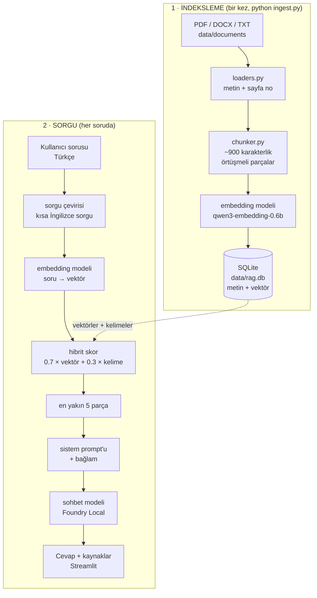

# Mimari

Her şey tek bir bilgisayarda çalışır. Dışarıya giden hiçbir ağ isteği yoktur
(modeller ilk kez indirilirken hariç).

## Genel görünüm



## Katmanlar

| Katman | Dosya | Sorumluluk |
|---|---|---|
| Belge okuma | `src/loaders.py` | PDF/DOCX/TXT → sayfa numaralı metin, dosya hash'i |
| Parçalama | `src/chunker.py` | Uzun metni örtüşmeli parçalara böler |
| Depo | `src/store.py` | SQLite şeması, vektörleri float32 BLOB olarak saklar |
| Model motoru | `src/backends.py` | Foundry Local (ana) / Ollama (yedek) ortak arayüz |
| RAG | `src/rag.py` | Arama, bağlam kurma, akışlı cevap |
| Arayüz | `app.py` | Streamlit sohbet penceresi |
| İndeksleme | `ingest.py` | Belgeleri veritabanına işler |
| Test | `eval.py` | Doğruluk ve "uydurma" testleri |
| Ayar | `config.py` | Tüm parametreler tek yerde |

## Neden bu tasarım?

**Neden SQLite, vektör veritabanı değil?**
279 parçalık bir indekste tüm vektörleri belleğe alıp tek matris çarpımı yapmak
milisaniyeler sürer. Özel bir vektör veritabanı ancak yüz binlerce parçada
anlamlı fark yaratır — buraya koymak gereksiz karmaşıklık olurdu. SQLite hem
Python'ın içinde hazır geliyor hem de tek dosya olduğu için taşınabilir.

**Neden embedding'ler BLOB olarak saklanıyor?**
JSON metni olarak saklamak yaklaşık 4 kat yer kaplar ve okurken her seferinde
parse edilmesi gerekir. `float32` ham baytları doğrudan numpy dizisine dönüşür.

**Neden iki ayrı model motoru var?**
Uygulama kodu model çağrısını doğrudan yapsaydı, Foundry Local'de bir sorun
çıktığında (platform, sürüm, kurulum) her şeyi yeniden yazmak gerekirdi.
`backends.py` ortak bir arayüz tanımlıyor; motoru değiştirmek tek bir ortam
değişkeni:

```bash
RAG_BACKEND=ollama streamlit run app.py
```

**Neden dosya hash'i tutuluyor?**
Aynı PDF'i her çalıştırmada yeniden vektörleştirmek dakikalar alır. `sha256`
özeti değişmediyse dosya atlanır; ikinci indeksleme saniyeler sürer.

**Neden arama hibrit (vektör + kelime)?**
Ölçtük: sadece vektör araması sayısal sorularda ("yorum kaç kelime?") cevabı
içeren parçayı ilk sıraya çıkaramıyordu, çünkü embedding'ler tam sayıları
bulanıklaştırır. IDF ağırlıklı kelime eşleşmesi bu açığı kapatıyor — `950` gibi
nadir bir token eşleştiğinde skoru belirgin biçimde yukarı çekiyor. Vektör
tarafı ise anlamı ve dil geçişini yakalıyor. İkisi tek başına yetersiz,
birlikte tamamlayıcı.

**Neden soru İngilizceye çevriliyor?**
Türkçe soru + İngilizce belge kombinasyonunda kosinüs skorları 0.35–0.55
bandında sıkışıyordu; cevabı içeren parça ile alakasız parça arasındaki fark
ayırt edilemeyecek kadar küçüktü. Sorguyu kısa bir İngilizce arama ifadesine
çevirmek hem vektör hem kelime tarafında ayrımı belirginleştiriyor. Orijinal
soru da korunuyor — çeviri kötü çıkarsa arama tamamen bozulmasın diye.

**Neden hiç alakalı parça bulunamadığında model çağrılmıyor?**
Model zaten cevabı bilemez. Çağırmak sadece bekleme süresi ve uydurma riski
demektir. Bu yüzden `rag.py` doğrudan "bulamadım" cevabını döner.
